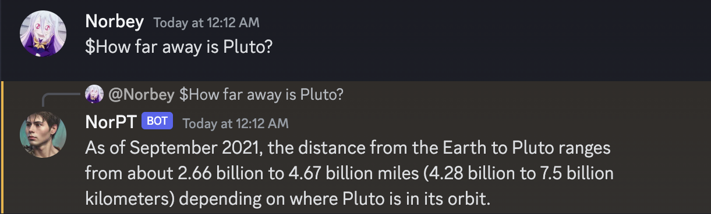
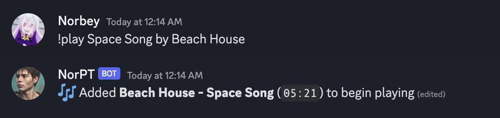

# NorPT

NorPT is a Discord bot that integrates OpenAI's ChatGPT and allows users to listen to any song on Discord. The aim of this project is to provide an easy way to use ChatGPT without having to open a browser, by integrating it with Discord's application. The project is hosted on Oracle's cloud servers, where it is closely monitored and running smoothly.

Please note that this bot is exclusively intended for personal use and is not available for use in other Discord servers though feel free to look through, provide feedback, and use as reference!

## Screenshots

 
 

## Technology

**Client:** Discord

**Server:** Node.js, Oracle Cloud, OpenAI, Discord.js

## Acknowledgements

- [Discord](https://discord.com/developers/docs/intro)
- [Oracle Cloud](https://www.oracle.com/cloud/compute/)
- [OpenAI](https://platform.openai.com/docs/introduction)
- [MusicBot](https://github.com/jagrosh/MusicBot)

## License

This project is licensed under the <a href="https://opensource.org/license/mit/" target="_blank">MIT License</a>.
